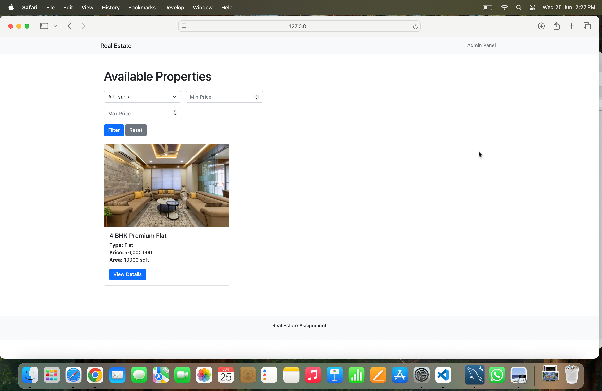

# Real-Estate-Assignment
This is the solution for the Real Estate Assignment Provided
# 🚀 Real Estate Management System

A complete real estate platform with admin dashboard, property listings, and booking system built with modern PHP practices.

## ✨ Features

- **Admin Portal**
  - Add properties with image uploads
  - View all listings
- **User Experience**  
  - Filter properties by type/price
  - Book viewing appointments
  - Responsive design
- **Technical Highlights**
  - MVC architecture
  - Eloquent ORM
  - Form validation
  - Secure file uploads

## 🛠️ Tech Stack

- Backend: Laravel 10
- Frontend: Bootstrap 5 + Blade
- Database: MySQL 8
- Storage: Local filesystem

## 🚀 Installation Guide

### Prerequisites

- PHP 8.1+
- MySQL 8.0+
- Composer 2.2+

### Step 1: Clone Repository
git clone https://github.com/yourusername/real-estate.git
cd real-estate

### Step 2: Install Dependencies
composer install

### Step 3: Configure Environment
cp .env.example .env
php artisan key:generate

### Edit .env file:
DB_CONNECTION=mysql
DB_HOST=127.0.0.1
DB_PORT=3306
DB_DATABASE=real_estate
DB_USERNAME=root
DB_PASSWORD=yourpassword

### Step 4: Setup Database
php artisan migrate --seed
php artisan storage:link

### Step 5: Launch Development Server
php artisan serve

### Questions
1. Do I need to add a login based functionality for the admin panel?
2. Do I need to enable multi image upload?

### More Functionalities that could be added
1. More Search Filters
2. Linking with Google Maps API so that the exact location of the property could be checked
3. Creating a full fledged admin panel to manage property listings
4. Informing the user via email or maybe a reminder of their propety appointment.
